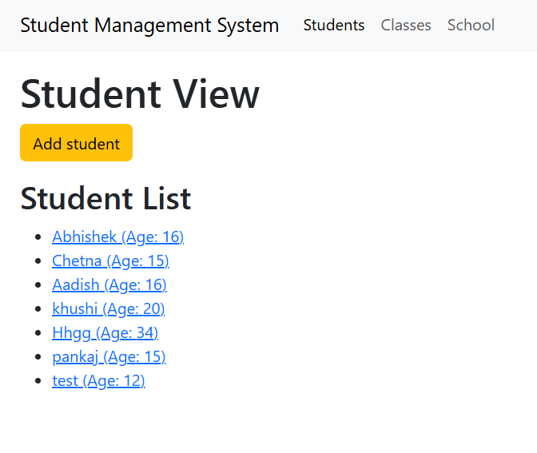
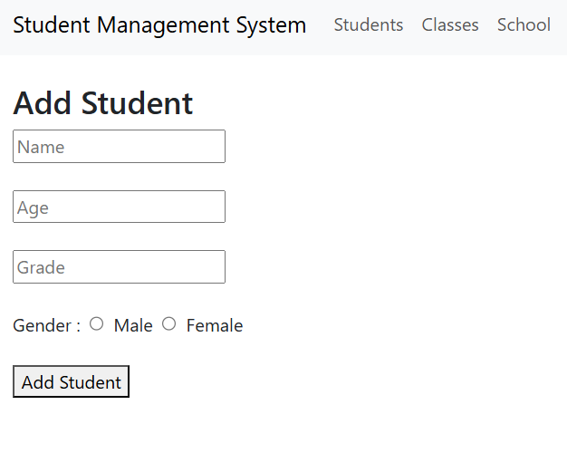
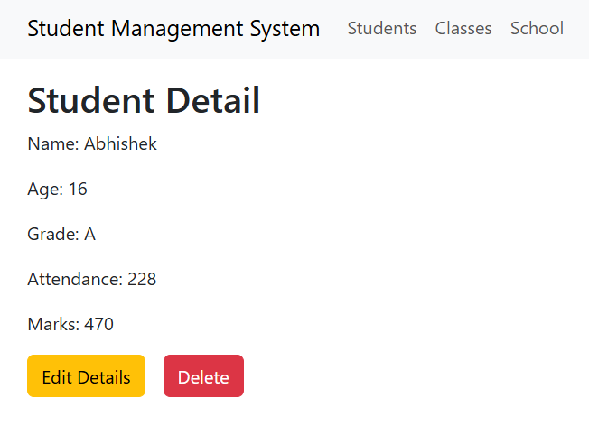
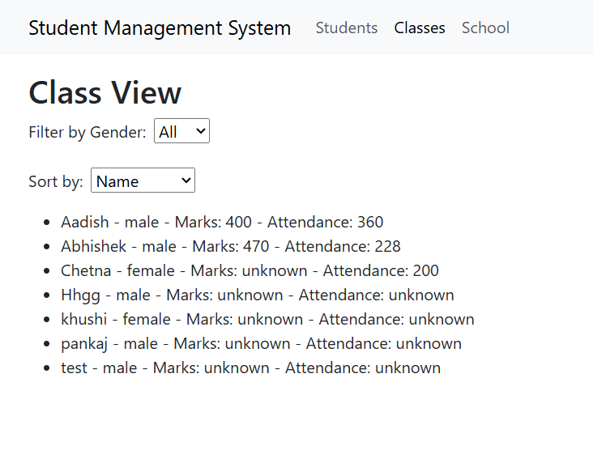
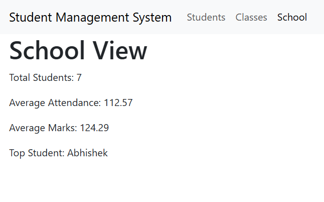

# Student Management System

A frontend student management application built with React and Redux Toolkit, demonstrating asynchronous CRUD operations, centralized state management, filtering, sorting, and school-wide analytics.

---

## Tech Stack

**Frontend**
- React.js
- Redux Toolkit
- React Router DOM
- JavaScript (ES6+)
- HTML5 & CSS3

**State Management**
- Redux Toolkit
- createSlice
- createAsyncThunk

**Backend**
- REST APIs

---

## Live Demo

[Live Application](https://redux-app-frontend.vercel.app)<br><br>

[Backend API](https://redux-app-backend-sigma.vercel.app)

---

## Screenshots

### Student List



### Add Student



### Student Details



### Class View



### School Dashboard



---

## Features

### Student Management

- View all students
- Add new students
- Update existing student records
- Delete student records

### State Management

- Centralized state management using Redux Toolkit
- Asynchronous CRUD operations with createAsyncThunk
- Loading and error state handling

### Class View

- Filter students by gender
- Sort students by name, marks, or attendance

### School Analytics

- Display total students
- Calculate average attendance
- Calculate average marks
- Identify the top-performing student

### User Experience

- Client-side routing with React Router
- Responsive interface
- Form validation for student management

---

## Quick Start

```bash
git clone https://github.com/Abhishek-Das251002/reduxApp---frontend.git

cd reduxApp---frontend

npm install

npm run dev
```
---

## Deployment

| Service | Platform |
|---------|----------|
| Frontend | Vercel |
| Backend  | Vercel |

---

## API Overview

### Students

- GET /students
- POST /students
- PUT /students/:id
- DELETE /students/:id

---

> **Note:** This project uses the backend API provided for the assignment. The backend source code is maintained separately.

---

## Future Improvements

- Add teacher management with CRUD functionality.
- Implement secure user authentication.
- Export student records as CSV reports.

---

## Contact

If you have any questions or would like to discuss this project, feel free to connect with me.

**Email:** [abhishekgautam1966@gmail.com](mailto:abhishekgautam1966@gmail.com)<br><br>

**LinkedIn:** [Abhishek Gautam](https://www.linkedin.com/in/abhishek-gautam-dev)
